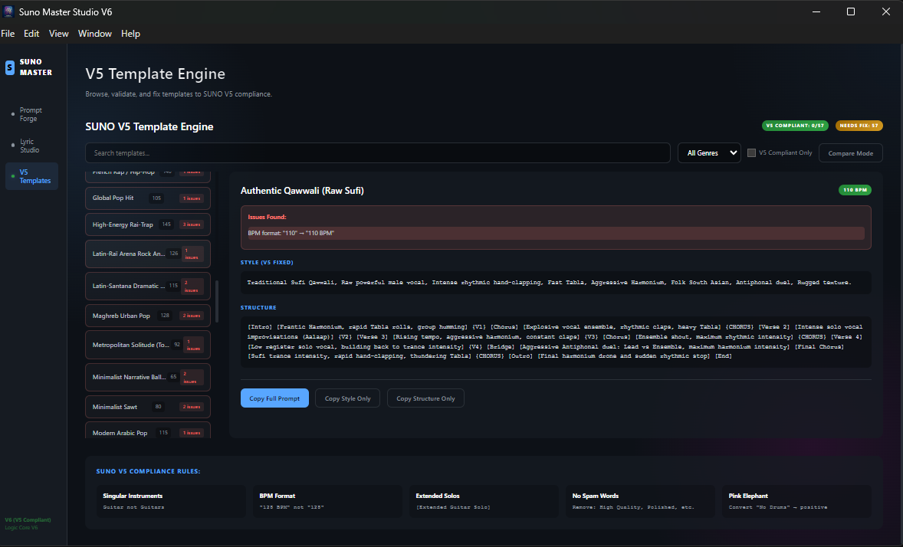
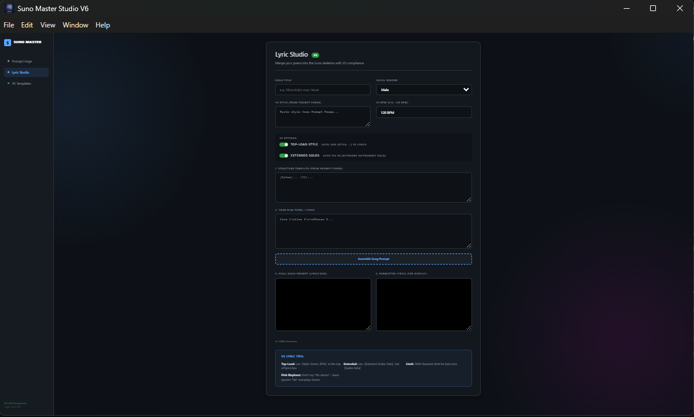
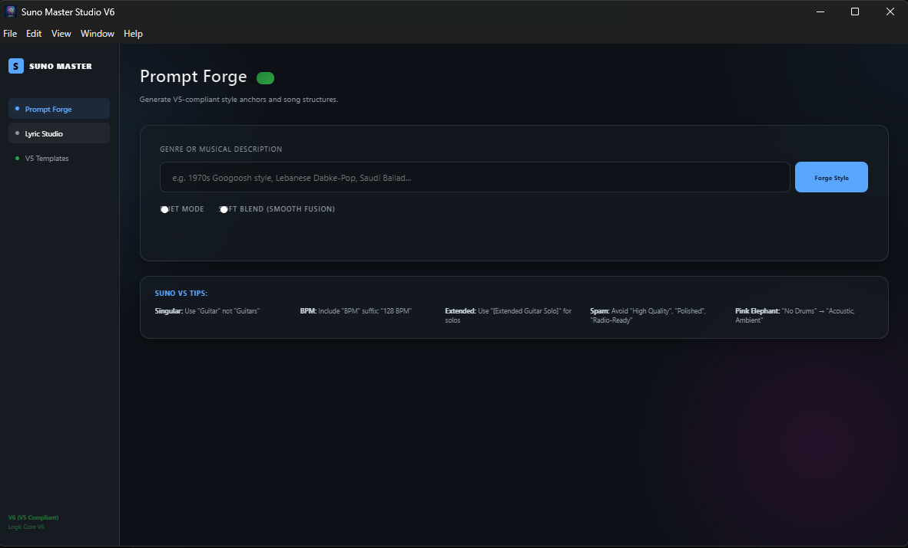

# Suno Master Studio V6


**A SUNO V5 compliant music prompt generator for professional music production.**

Generate industry-standard music prompts with automatic V5 compliance checking, 57+ regional templates, and intelligent genre matching.

## Screenshots

### Prompt Forge

Generate V5-compliant style anchors and song structures with one click.

### Lyric Studio

Write and validate lyrics with structure templates and BPM checking.

### V5 Template Engine

Browse, validate, and manage 57+ regional music templates.

## Overview

Suno Master Studio V6 is a desktop application that helps music producers create SUNO AI-compatible prompts that follow the latest V5 format requirements. It features automatic validation, regional genre templates, and a powerful prompt engine.

## Key Features

| Feature | Description |
|---------|-------------|
| **Prompt Forge** | Generate V5-compliant style anchors and song structures |
| **Lyric Studio** | Write and validate lyrics with structure templates |
| **V5 Template Engine** | Browse, validate, and manage 57+ regional templates |
| **Compliance Checking** | Automatic validation against SUNO V5 rules |
| **Regional Templates** | Support for Arabic, Persian, Turkish, South Asian, Latin, and more |
| **Soft Blend Mode** | Smooth genre fusion for creative combinations |

## SUNO V5 Compliance

This app enforces strict SUNO V5 compliance:

| Rule | Correct | Incorrect |
|------|---------|-----------|
| Singular instruments | `Guitar` | `Guitars` |
| BPM format | `128 BPM` | `128` |
| Extended solos | `[Extended Guitar Solo]` | `[Guitar Solo]` |
| Genre first | `Arabic Pop, 125 BPM...` | `125 BPM, Arabic Pop...` |
| No spam words | (removed) | `High Quality, Radio-Ready` |
| Pink Elephant fix | `Acoustic, Ambient` | `No Drums` |

### V5 Rules Explained

- **Singular Instruments** - SUNO expects singular form: "Guitar" not "Guitars"
- **BPM Suffix** - Always include "BPM": "128 BPM" not "128"
- **Extended Solos** - Use `[Extended Guitar Solo]` to force SUNO to play solos
- **Genre First** - Start style prompts with genre: "Arabic Pop, 125 BPM..."
- **No Spam** - Remove generic words: "High Quality", "Polished", "Radio-Ready"
- **Pink Elephant** - Convert negatives to positives: "No Drums" → "Acoustic, Ambient"

## Regional Templates

### Arabic
- Lebanese (Dabke-Pop, Ballads, Jazz, 90s Style)
- Khaleeji/Saudi (Romance, Dance, 6/8 Khabbaiti, Wihda)
- Egyptian (Shaabi, Folk Ballad, Jazz Fusion, Nu-Disco)
- Maghreb (Rai, Gnawa, Moroccan Fusion, Chaabi)

### Persian/Iranian
- Traditional (Dastgah, Avaz, Classical)
- Modern Iranian Pop (1970s Retro, Tehran Style, Googoosh)

### Turkish & Ottoman
- Classical Turkish Makam
- Neo-Tarab Fusion
- Arabesque

### South Asian
- Qawwali (Traditional, Muqabla, Sufi)
- Ghazal (Urdu, Mohani Style)
- Bollywood (Filmi, Item Number, 90s)
- Punjabi (Folk, Attan)

### Other Genres
- Latin (Salsa, Merengue, Bossa Nova)
- Rock (Alternative, Stadium, Latin-Rock)
- Electronic (Techno, Synthwave, Drill, Trap)
- Country (Modern, Ballad)
- Orchestral (Cinematic, Marching, Epic)

## Installation

### From Release
Download the latest release from the [Releases page](https://github.com/saeedalsuri/suno-master-studio/releases).

### Build from Source

```bash
# Clone the repository
git clone https://github.com/saeedalsuri/suno-master-studio.git
cd suno-master-studio

# Install dependencies
npm install

# Run in development mode
npm run dev

# Build for production
npm run build
```

## Usage

### Prompt Forge
1. Enter a genre or musical description (e.g., "1970s Googoosh style", "Lebanese Dabke")
2. Toggle **Duet Mode** or **Soft Blend** if needed
3. Click **Forge Style** to generate
4. Copy the Style Anchor to SUNO
5. Check V5 compliance status

### Lyric Studio
1. Navigate to Lyric Studio tab
2. Import structure from Prompt Forge or start fresh
3. Add verses using placeholders: `{V1}`, `{CHORUS}`, `{BRIDGE}`
4. Validate BPM format

### V5 Template Engine
1. Browse 57+ pre-built templates
2. Filter by genre or BPM range
3. Validate templates for V5 compliance
4. Copy validated templates

## Tech Stack

| Technology | Version |
|------------|---------|
| Electron | 33 |
| React | 19 |
| Vite | 6 |
| electron-builder | 25 |

## Project Structure

```
SunoMasterStudio_V6/
├── src/
│   ├── App.jsx                    # Main app component
│   ├── App.css                    # Main styles
│   ├── utils/
│   │   └── sunoLogic.js           # V5 Logic Core (765 lines)
│   ├── data/
│   │   ├── options.js             # Genre knowledge base
│   │   └── templates.json         # 57+ regional templates
│   └── components/
│       ├── LyricStudio.jsx        # Lyric editor
│       ├── LyricStudio.css        # Studio styles
│       └── V5TemplateEngine.jsx   # Template browser
├── build/
│   └── icon.ico                   # App icon
├── electron-main.js               # Electron main process
├── package.json                  # Dependencies & scripts
└── vite.config.js                # Vite configuration
```

## API Reference

The V5 Logic Core provides these functions:

```javascript
import { SunoLogicCore } from './utils/sunoLogic';

// Generate a creative prompt
const prompt = SunoLogicCore.generateCreativePrompt(
  "Lebanese Dabke",  // genre input
  isDuet,            // duet mode
  isSoftBlend         // soft blend mode
);

// Check V5 compliance
const compliance = SunoLogicCore.checkV5Compliance({
  style: prompt.style,
  bpm: prompt.bpm,
  structure: prompt.structure
});

// Apply automatic fixes
const fixed = SunoLogicCore.applyV5Fixes(template);
```

## Contributing

Contributions welcome! Please see [CONTRIBUTING.md](CONTRIBUTING.md).

## License

MIT License - see [LICENSE](LICENSE) file.

## Changelog

See [CHANGELOG.md](CHANGELOG.md) for version history.

## Repository

**GitHub:** https://github.com/saeedalsuri/suno-master-studio

**Issues:** https://github.com/saeedalsuri/suno-master-studio/issues

---

*Built for music producers who demand V5 compliance.*
